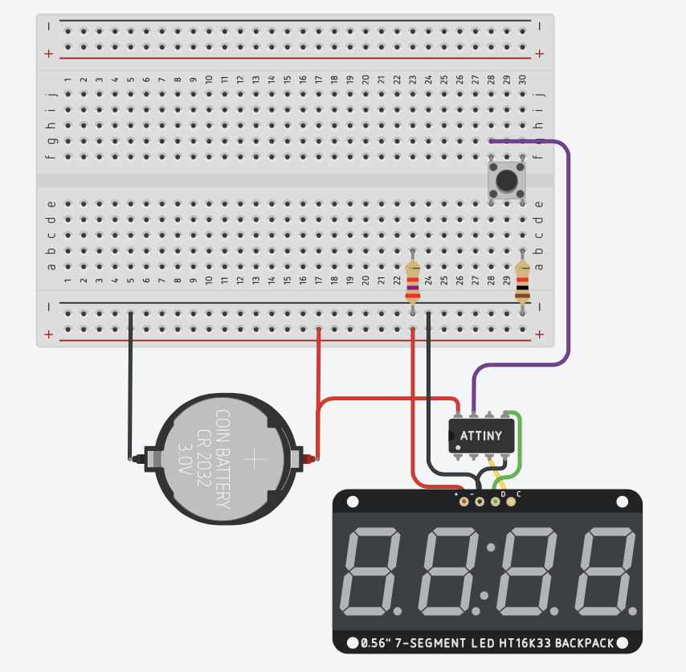

# I2C clock using HT16K33 and ATTiny

## Setup
1. Recreate a circuit in Tinkercad

2. Use the following schema

3. Paste the code from clock.c

## Using the clock
Use button to set the time, long press makes it increment quicker.
After setting the time, it will increment automatically every minute.
> Note that in Tinkercad simulation it may take longer than one minute to increment!!

